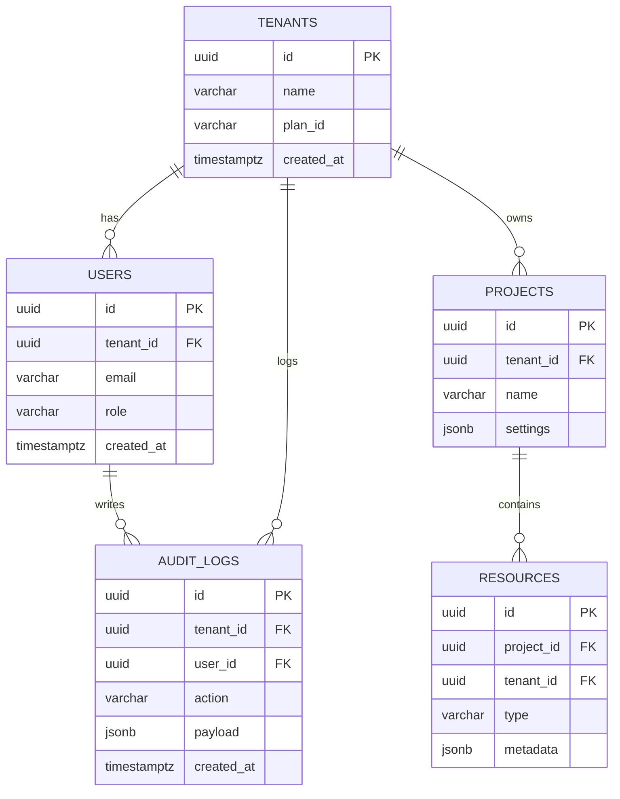

# Product-Ready Mobile + Web Application Blueprint

This document is a full, production-ready blueprint you can hand to engineering and product teams. It contains:

* System architecture (high level)
* ERD (Mermaid) and database decisions (multi-tenant ready)
* API design & endpoints (REST + GraphQL notes)
* Folder structure (web, mobile, backend, infra)
* CI/CD, deployment & infra pattern
* Observability, scaling, security, and cost considerations
* 0 → V1 roadmap, milestones, and checklist

---

## 1. Executive summary

Goal: Build a fast, scalable, secure mobile-first product with parity on web and mobile. Use modern, widely-supported technologies that enable rapid feature development, strong DX, and enterprise-grade operational reliability.

Primary choices (recommended):

* Frontend (Web): **Next.js (TypeScript) + TailwindCSS + ShadCN + Radix**
* Mobile: **React Native (Expo) + Nativewind**
* Backend: **NestJS (TypeScript) + Prisma**
* Database: **MongoDB Atlas (Free Tier / Serverless) **
* Cache & Queue: **Redis + BullMQ**
* Storage: **S3 (or R2)**
* Auth: **Auth0 / Supabase Auth / Cognito (choose per preference)**
* DevOps: **GitHub Actions, Docker, Terraform, AWS (RDS, ECS/EKS/Amplify)**

---

## 2. High-level architecture

Merit: separation of concerns, stateless API servers, managed stateful services, CDN for static assets, and a background worker fleet for heavy jobs.

```mermaid
flowchart LR
  subgraph Client Layer
    W[Web (Next.js)]
    M[Mobile (React Native / Expo)]
  end

  subgraph CDN
    CDN[CDN (CloudFront / Fastly / Vercel CDN)]
  end

  subgraph API Layer
    API[API Gateway / Load Balancer]\n(NestJS Autoscaling)
    AuthSvc[Auth Service (Auth0/Cognito/Supabase)]
  end

  subgraph Services
    AppDB[(MongoDB Atlas)]
    Cache[(Redis)]
    Queue[(BullMQ Workers)]
    FileStore[(S3)]
    Search[(OpenSearch / Elastic)]
    Worker[Background Workers]
  end

  W -->|HTTPS| CDN -->|HTTPS| API
  M -->|HTTPS| API
  API --> AuthSvc
  API --> AppDB
  API --> Cache
  API --> Queue
  Worker --> Queue
  Worker --> AppDB
  API --> FileStore
  API --> Search
```

---

## 3. Database & ERD (multi-tenant)

### Multi-tenancy approach (recommended)

* **Single database, tenant-aware rows** using `tenant_id` on business tables. Keep meta/lookup tables global.
* Use Row-Level Security (RLS) in Postgres if using separate DB roles per tenant is desired.
* Optionally migrate high-value tenants to dedicated schemas/dbs later.

### Core tables (simplified)

* `tenants` (id, name, plan_id, billing_info, status, created_at)
* `users` (id, tenant_id, email, password_hash, role, profile, created_at)
* `auth_sessions` (id, user_id, refresh_token_hash, expires_at)
* `projects` (id, tenant_id, name, settings, created_at)
* `resources` (id, project_id, tenant_id, type, metadata)
* `audit_logs` (id, tenant_id, user_id, action, payload, created_at)

### ERD (Mermaid)



### Indexing & performance

* Index on `tenant_id` + frequently queried fields (e.g., `tenant_id, created_at`).
* Use partial indexes for boolean flags and where clauses.
* Use connection pooling (PgBouncer) for serverless environments.

---

## 4. API design

### API style

* Use **REST** for most resources (CRUD). Use **GraphQL** only if product needs flexible client-side queries and complex client interactions.
* Version your API (e.g., `/v1/`), and prefer **stable contracts**.

### Example REST endpoints

* `POST /v1/auth/login` — returns access+refresh token
* `POST /v1/auth/refresh` — rotates refresh token
* `GET /v1/tenants/:tenantId/projects` — list
* `POST /v1/tenants/:tenantId/projects` — create
* `GET /v1/tenants/:tenantId/projects/:id` — detail
* `PATCH /v1/tenants/:tenantId/projects/:id` — update

### API concerns

* Enforce RBAC & tenant scoping in middleware/guards
* Rate limit per tenant
* Input validation: `Zod` or `class-validator`
* Response standard: `{ success: boolean, data: ..., errors: [...] }`

---

## 5. Authentication & Authorization

* Use an external provider OR Hosted auth for speed (Auth0, Cognito, Supabase Auth).
* Support email+password, OAuth (Google, Apple), SSO (SAML/OIDC for enterprise)
* Implement RBAC: roles `superadmin`, `admin`, `member`, `viewer`.
* For internal APIs, use mTLS or signed tokens.

---

## 6. Folder structure

### Monorepo recommended (Turborepo / pnpm / Nx)

```
/ (repo root)
  apps/
    web/ (Next.js)
    mobile/ (Expo / React Native)
    api/ (NestJS)
  packages/
    ui/ (shared React components, shadcn)
    config/ (eslint, prettier, tsconfig)
    sdk/ (shared client SDK + types)
    db/ (mongoose models & schema) 
  infra/
    terraform/
    k8s/
    scripts/
  .github/
  docker/
```

### Frontend (web) structure

```
web/
  app/  (Next.js app router)
  components/
  modules/ (feature modules)
  services/ (api clients)
  styles/
  public/
```

### Mobile (expo) structure

```
mobile/
  src/
    screens/
    components/
    navigation/
    hooks/
    services/
```

### Backend (NestJS)

```
api/
  src/
    modules/
      auth/
      users/
      tenants/
      projects/
      jobs/
    common/
    main.ts
  worker/ (separate worker app)
  mongoose/
```

---

## 7. Design System & UI

**Design tokens** (single source): colors, spacing, radii, shadows, typography.

**Component system**:

* Atoms: Button, Input, Icon, Badge
* Molecules: FormRow, Modal, TableRow
* Organisms: Navbar, Sidebar, DashboardGrid
* Templates: ProjectPage, SettingsPage

**Accessibility:**

* Use Radix primitives + proper aria attributes
* Keyboard navigation and focus states

**Dark mode:** Use token overrides and Tailwind `dark` class

---

## 8. DevOps: CI/CD, infra, and release strategy

### CI/CD

* **Git workflow:** main (production), develop (staging), feature branches
* **Pipeline:** GitHub Actions

  * Lint → Test → Build → Unit tests → Integration tests → Deploy to staging
* **Preview environments** for PRs (Vercel for web, EAS / Expo preview for mobile)

### Infra as Code

* **Terraform** for infra provisioning (RDS, S3, VPC, ECR)
* Use modules for common infra patterns (network, db, compute)

### Hosting options

* Web: Vercel / Netlify / CloudFront + S3
* API: AWS ECS Fargate / EKS / Render
* Database: MongoDB Atlas (Free Tier or Serverless)
* Workers: ECS / Fargate / Dedicated EC2 autoscaling

### Deployment strategy

* Blue/green or rolling deploys
* Health checks & readiness probes
* Feature flags (Unleash / LaunchDarkly / GrowthBook)

---

## 9. Observability & SRE

* **Logging:** Structured logs (JSON) to ELK or Hosted solutions (Datadog/Logz.io)
* **Tracing:** OpenTelemetry + Jaeger or Datadog traces
* **Metrics:** Prometheus + Grafana or Datadog
* **Alerts:** PagerDuty / Opsgenie integration for high-severity alerts
* **SLOs:** Uptime, latency percentiles (p50/p95/p99)

---

## 10. Security & Compliance

* TLS everywhere
* WAF (AWS WAF) and rate limiting
* Secrets in Secrets Manager / Parameter Store / Vault
* Daily/weekly dependency scanning (Dependabot, Snyk)
* Pen tests and periodic security audits
* GDPR-ready: data export/delete flows, encryption at rest and in transit

---

## 11. Cost considerations (starter vs scale)

* Start cheap: Managed DB (db.t3.small or Neon free), Vercel hobby, Redis free tier
* Plan for scale: RDS standard (multi-AZ), Redis cluster, dedicated search nodes
* Watch storage & egress costs (S3, CDNs)

---

## 12. 0 → V1 Roadmap (8–12 week plan, single team)

### Week 0: Planning

* Finalize MVP scope & acceptance criteria
* Create product backlog & wireframes
* Set up repo, CI, and basic infra

### Week 1–2: Foundations

* Auth flow, tenant + user models, DB migrations
* Base API skeleton, validation, error handling
* Basic web skeleton (Next.js), shared UI, design tokens

### Week 3–4: Core product

* Projects CRUD, resources
* Mobile skeleton + navigation
* File uploads & storage integration
* RBAC & basic audit logs

### Week 5–6: Polish & ops

* Background jobs, queue, and worker flows
* Search integration (OpenSearch)
* Observability setup (logs, metrics, basic alerts)

### Week 7–8: QA & launch prep

* E2E tests, load tests, security scan
* Beta release to selected tenants
* Production infra hardening (multi-AZ DB, backups)

### Post-launch

* Monitoring, iterate on feedback, add enterprise features (SSO, invoices)

---

## 13. Deliverables I can produce for you (pick any)

1. System architecture diagram (PNG/SVG)
2. Detailed ERD and Prisma schema
3. Postgres schema + recommended indexes
4. NestJS folder scaffold & boilerplate code
5. Next.js + Tailwind scaffold with design tokens and sample pages
6. Expo app scaffold and shared component library
7. GitHub Actions CI/CD templates + Terraform starter module
8. Detailed rollout checklist & runbook

---

## 14. Next recommended immediate steps

* Confirm MVP feature list (short & long) — I can then generate a prioritized backlog and acceptance criteria.
* Choose Auth provider (Auth0 / Cognito / Supabase) — I will provide integration code and config.
* Decide hosting preference (full AWS vs Vercel + managed services) — I will prepare Terraform and cost estimate.

---

**If you want, pick 3 deliverables from section 13 and I will create those next.**

*End of blueprint.*
